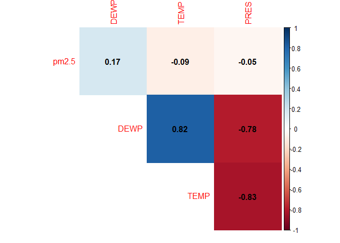
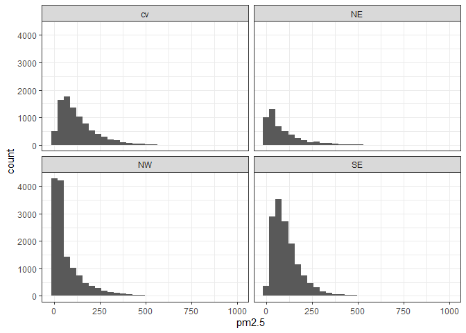
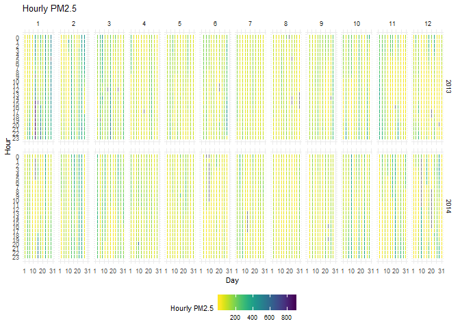
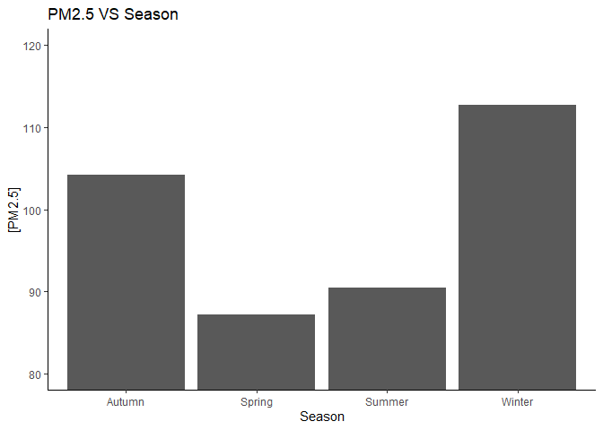
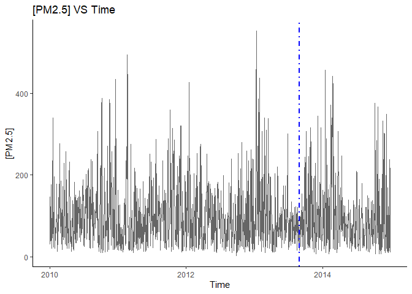

## Beijing PM2.5   
### Introduction  
Beijing, the capital city of China, is fighting against `PM2.5` pollution in recent years. `PM2.5` refers to fine airborne particles with a diameter of 2.5μm or less. They can cause severe damage to human health by triggering lung cancer, heart diseases, stroke, and respiratory infections. A Nature study pointed out that in 2016 only, `PM2.5` was associated with over four million deaths worldwide. In the past decades, the air quality in Beijing has been faced with great pressure resulting from the rapid development of industry. In order to secure its citizens’ health, Chinese government has taken action to mitigate the influence of `PM2.5` since September, 2013.      
Previous studies showed that __meteorological conditions__, such as wind and humidity, could contribute to the formation of `PM2.5`. Therefore, we speculate that there could be correlations between Beijing’s `PM2.5` concentration and the meteorological conditions in a sufficient period of time. If so, knowing the meteorological conditions can support the assessment and even prediction of air quality in Beijing. 
 
### Data Description  
The [dataset](https://archive.ics.uci.edu/ml/datasets/Beijing+PM2.5+Data#) used in our project was obtained from University of California Irvine Machine learning Repository. It was originally uploaded by Songxi Chen in Peking University, China. This is an hourly dataset containing 1) the `PM2.5` of US Embassy in Beijing and 2) __meteorological statistics__ from Beijing Capital International Airport. The data was collected from Jan 1st, 2010 to Dec 31st, 2014. The original purpose of the dataset was to assess the effect of Chinese government’s pollution reduction plan which started from September in 2013. The dataset can be downloaded [here](https://archive.ics.uci.edu/ml/machine-learning-databases/00381/PRSA_data_2010.1.1-2014.12.31.csv).     

Below are the variables in the dataset:    

| Variable          | Type             | Description | 
|-------------------|------------------|-------------|
| year              | Quantitative     |Year of data in this row|
| month             | Quantitative     |Month of data in this row|
| day               | Quantitative     |Day of data in this row|
| hour              | Quantitative     |Hour of data in this row|
| `PM2.5`           | Quantitative     |`PM2.5` concentration (ug/m^3)|
| DEWP              | Quantitative     |Dew Point (℃)|
| TEMP              | Quantitative     |Temperature (℃)|
| PRES              | Quantitative     |Pressure (hPa)|
| cbwd              | Categorical      |Combined wind direction|
| lws               | Quantitative     |Cumulated wind speed (m/s)|
| ls                | Quantitative     |Cumulated hours of snow|
| lr                | Quantitative     |Cumulated hours of rain|

### Dataset loading


```r
df<-read.csv("https://archive.ics.uci.edu/ml/machine-learning-databases/00381/PRSA_data_2010.1.1-2014.12.31.csv")
```


```r
sum(is.na(df$pm2.5))/length(df$pm2.5)
```

```
## [1] 0.04716594
```

So there are 4.73% missing values in the `PM2.5` variable, which shows the data quality is reasonably good. We generated a new dataset for some plots by omitting the missing values.


```r
df_clean<- na.omit(df)
```

### Dataset exploration   
1.	We are interested in the correlation between meteorological conditions (dew point, temperature and pressure) and `PM2.5`. Thus, we created a __correllogram__ of `DEWP`, `TEMP`, `PRES`, and `PM2.5`. The graph shows that there each of `DEWP`, `TEMP`, and `PRES`could hardly predict `PM2.5`.


```r
df_corr<-cor(df_clean[6:9]) %>% # get the correlation of the four columns DEWP, TEMP, PRES, and PM2.5 against each other.
  round(2)

corrplot(df_corr,
         type = "upper",
         method = "color",
         addCoef.col = "black",
         diag = FALSE)
```

<!-- -->

2.	Wind is one of the important elements of weather conditions, and could also influence the formation of `PM2.5`. Therefore, we used a __faceted histogram__ in order to check the distribution of `PM2.5` under different wind directions (northwest, northeast, southwest and southeast).


```r
df_clean %>% ggplot(aes(pm2.5))+
  geom_histogram()+
  facet_wrap(~cbwd)+
  theme_bw()
```

```
## `stat_bin()` using `bins = 30`. Pick better value with `binwidth`.
```

<!-- -->


3.	In addition to meteorological conditions, we are curious about the potential influence of time on `PM2.5`, so we created a __heat map__ showing `PM2.5` in different hours and months in the year of 2013 and 2014. 

```r
# We adopted the code from the following GitHub gist
# Title: HeatmapHrByDay.R
# Author:  John MacKintosh
# Date: Dec 15, 2016
# Availability: https://gist.github.com/johnmackintosh/520643a1f82a0c7df00cf949ba98a4e9#file-heatmaphrbyday-r

p <- df %>% filter(year>=2013) %>% 
  ggplot(aes(day,hour,fill=pm2.5))+
  geom_tile(color= "white",size=0.1) +
  scale_fill_viridis(name="Hourly PM2.5", direction = -1)+ #Sets the order of colours in the scale reverse
  facet_grid(year~month)+
  scale_y_continuous(trans = "reverse", breaks = unique(df$hour))+
  scale_x_continuous(breaks =c(1,10,20,31))+
  theme_minimal(base_size = 8)+
  labs(title= "Hourly PM2.5", x="Day", y="Hour")+
  theme(legend.position = "bottom")

p
```

<!-- -->

4.	We also create a __histogram__ emphasizing the severity of `PM2.5` in different seasons. We can see from the graph that autumn and winter tend to have the most severe `PM2.5` pollution.    

```r
df_hist <- df_clean %>% 
  mutate(season = case_when(month == 12 ~ 'Winter', month >= 9 ~ 'Autumn', month >= 6 ~ 'Summer', month >= 3 ~ 'Spring',TRUE ~ 'Winter'))  # Group dates to seasons
df_hist = aggregate(df_hist$pm2.5,
                by = list(df_hist$season),
                FUN = mean) # Mean [PM2.5] of each season
df_hist = rename(df_hist, c("season" = "Group.1", "PM2.5" = "x")) 
(season_pmconc <- ggplot(data = df_hist, aes(x=season, y = PM2.5)) +
  geom_bar(stat="identity")+
  coord_cartesian(ylim=c(80,120))+
  labs(x = "Season", 
       y = "[PM2.5]",
       title = "PM2.5 VS Season") +
  theme_classic()) 
```

<!-- -->

5.	In order to check the effect of `PM2.5` reduction plan initiated by Chinese government in September, 2013, we generated a __line chart__ showing how `PM2.5` changes across time. The `PM2.5` concentration seems to fluctuate, and there is no significant drop from 2010 to 2014.     


```r
df_year_change <- df_clean
df_year_change$date = as.Date(with(df_year_change, paste(year, month, day,sep="-")), "%Y-%m-%d") # Combine day, month and year to date
df_year_change = aggregate(df_year_change$pm2.5,
                by = list(df_year_change$date),
                FUN = mean) # Mean [PM2.5] of each date
df_year_change = rename(df_year_change, c("date" = "Group.1", "PM2.5"="x"))
(year_conc = ggplot(data = df_year_change) +
  geom_line(aes(x=date, y=PM2.5), 
            alpha = 0.6,
            size = 0.6) +
  geom_vline(xintercept = as.numeric(as.Date("2013-09-01")), linetype=4, color = "blue", size = 1)+
  labs(x = "Time", 
       y = "[PM2.5]",
       title = "[PM2.5] VS Time") +
  theme_classic())
```

<!-- -->

```r
?geom_vline
```

```
## starting httpd help server ... done
```

### Research Question    
Our main research question is an _exploratory_ question: does the `PM2.5` in Beijing correlates with meteorological conditions and time? Sub-questions as below are also _exploratory_ as they all focus on the correlation between `PM2.5` and a certain variable.    
-	`PM2.5` VS. physical parameters (dew point, temperature and pressure).    
-	`PM2.5` VS. wind.     
-	`PM2.5` VS. special weather conditions (rain and snow).     
-	`PM2.5` VS. time (year, month, a time in a day).    

### Plan of Action   
1.	Deal with missing values.
2.	Run tests of correlation between `PM2.5` and meteorological statistics/time.
3.	Perform a linear regression analyses and plot quantitative variables in a regression line.
4.	Demonstrate the correlation between `PM2.5` and categorical variables. Only wind direction is a categorical variable at first, but categorical time units (season, day or night) can also be adapted from quantitative records.
5.	Create an interactive dashboard showing potential correlations between meteorological conditions/time and `PM2.5`.
6.	Address the effectiveness of Chinese government’s action on solving air quality issues.

### References
Liang, X., Zou, T., Guo, B., Li, S., Zhang, H., Zhang, S., Huang, H. and Chen, S. X. (2015). Assessing Beijing's PM2.5 pollution: severity, weather impact, APEC and winter heating. Proceedings of the Royal Society A, 471, 20150257.
